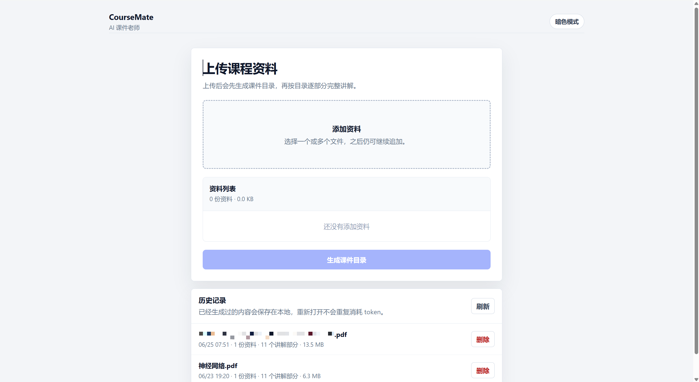
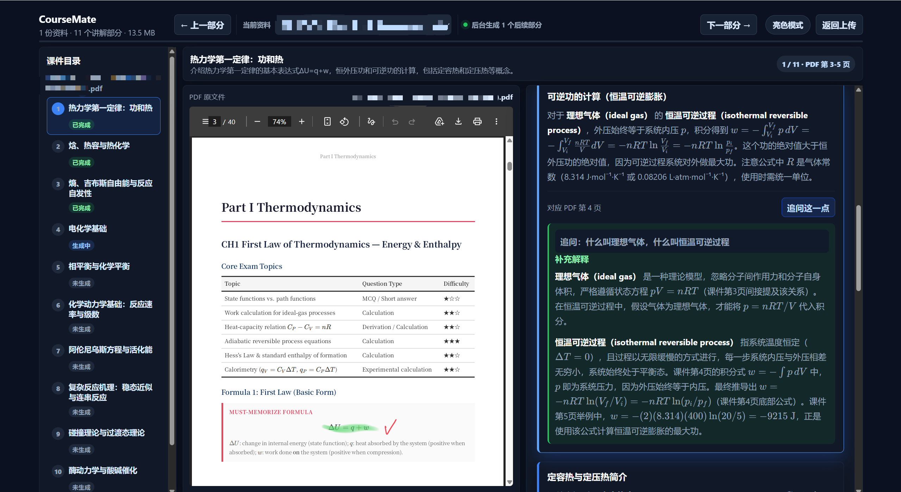
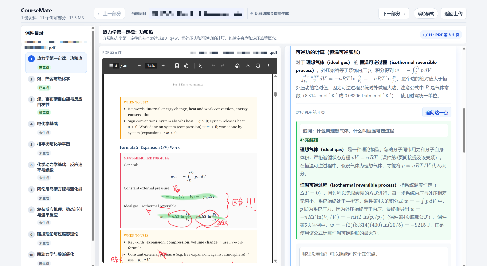

# CourseMate

<p align="center">
  <strong>Turn lecture slides into an AI course tutor that explains every section and answers follow-up questions.</strong>
</p>

<p align="center">
  CourseMate is designed for students who need to understand course materials more efficiently. Upload PDF lectures or study files, generate a structured course outline, and study with the original PDF on one side and AI explanations on the other.
</p>

<p align="center">
  <code>PDF Side-by-Side Reading</code>
  ·
  <code>Detailed AI Explanation</code>
  ·
  <code>Bilingual Terminology</code>
  ·
  <code>Follow-Up Questions</code>
  ·
  <code>Saved Study History</code>
  ·
  <code>Light / Dark Mode</code>
</p>

---

## Product Overview

CourseMate is not a simple slide summarizer. It is closer to an AI tutor that helps students learn from the ground up.

It is built for situations where students have long lecture PDFs, unfamiliar concepts, dense formulas, or English course materials that are hard to understand by reading alone.

CourseMate helps by:

- Explaining course materials section by section instead of only listing key points.
- Keeping important English technical terms while explaining them in Chinese.
- Showing the original PDF and AI explanation side by side.
- Allowing students to ask follow-up questions on any specific knowledge point.
- Saving generated explanations locally so students can continue later without regenerating everything.

The product is especially useful for university lectures, exam revision, English slides, formula-heavy courses, and self-study sessions where students need a clearer teacher-like explanation.

---

## Interface Preview

### 1. Upload Course Materials

The home screen focuses on the essential study workflow: upload materials, review the file list, and open saved history. Students can click the upload area or drag files directly into it.



### 2. Dark Study Mode

Dark mode is designed for long study sessions. The left panel shows the course outline, the center panel displays the original PDF, and the right panel shows the AI explanation with follow-up answers.



### 3. Light Study Mode

Light mode provides a clean reading experience. The AI explanation keeps English terminology, formulas, and Chinese explanations in the same learning context.



---

## Key Features

### Multi-File Upload

CourseMate supports uploading multiple study materials at once. Students can also add more files later.

Supported upload methods:

- Click the upload area to select files.
- Drag and drop files into the upload area.

Selected files appear in a file queue. Students can remove individual files or clear the entire list. Duplicate files are automatically ignored.

### Automatic Course Outline

After the materials are uploaded, CourseMate reads the extracted content and generates a clickable course outline.

The outline is designed around the semantic structure of the lecture, not a fixed character count. Each section has a clear generation status so students can see what is already available and what is still being generated.

Section states include:

- Completed
- Generating
- Not generated
- Failed, retry available

### Original PDF and AI Explanation Side by Side

The learning interface uses a three-column layout:

| Area | Purpose |
| --- | --- |
| Left outline | Navigate between lecture sections and knowledge points |
| Center PDF viewer | Display the original lecture PDF with its layout, formulas, figures, and annotations |
| Right explanation | Show detailed AI-generated explanations |

This layout is built for direct comparison. Students can read the original slide while immediately seeing the AI explanation for the corresponding section.

### Detailed Section-by-Section Teaching

CourseMate is designed to explain, not compress.

The AI tutor aims to:

- Explain concepts in Chinese while preserving important English terms.
- Clarify definitions, formulas, examples, and derivations.
- Avoid shallow summaries or generic key-point lists.
- Treat university course materials as something the student may be learning from zero.
- Keep English terminology visible so students can still handle English exams and lecture slides.

### Background Generation

When a student is reading the current section, CourseMate can generate upcoming sections in the background.

This makes the learning flow smoother: once a section is generated, clicking “Next Section” can open it immediately instead of waiting for the model every time.

### Follow-Up Questions

Every knowledge block includes a follow-up question area. Students can ask about the exact point they do not understand.

Example questions:

- “Why is this formula derived this way?”
- “What does ideal gas mean here?”
- “Can you explain this example step by step?”

Keyboard shortcuts:

- `Enter`: send the question.
- `Shift + Enter`: insert a new line.

Follow-up answers are displayed under the same knowledge block, so the explanation stays attached to the original context.

### Study History and Resume

Generated study sessions are saved locally. Students can refresh the page, close the browser, and later continue from the history list.

Saved history includes:

- Uploaded material information.
- Generated course outline.
- Generated AI explanations.
- Follow-up questions and answers.
- Last reading position.

When a history record is deleted, the corresponding local stored files are also removed.

### Light and Dark Mode

CourseMate supports both light and dark themes. The selected theme is saved automatically and remains active after refresh or navigation.

---

## How to Use

```text
Upload course materials
    ↓
Generate course outline
    ↓
Enter the learning interface
    ↓
Choose a section from the outline
    ↓
Read the original PDF
    ↓
Study the AI explanation
    ↓
Ask follow-up questions when needed
    ↓
Resume later from saved history
```

### Step 1: Upload Materials

Open the home page and add your course files.

Recommended materials:

- PDF lecture slides
- PDF handouts
- Word documents
- TXT study notes

### Step 2: Generate the Outline

After confirming the file list, click the button to generate the course outline.

CourseMate will analyze the materials and prepare the learning structure. For longer documents, later sections may continue generating in the background.

### Step 3: Study with PDF and Explanation

In the learning interface, students can:

- Click the outline to jump between knowledge points.
- Use “Previous Section” and “Next Section” to study in order.
- Read the original PDF in the center panel.
- Read detailed AI explanations in the right panel.

### Step 4: Ask Follow-Up Questions

If a concept is unclear, click “Ask About This Point” under the relevant block and enter a question. The AI will answer based on the current section, the original lecture text, and the student’s question.

### Step 5: Continue from History

The home page includes a history list. Opening a previous record restores the generated outline, explanations, follow-up answers, and reading progress.

---

## Local Setup

### Install Dependencies

```bash
npm.cmd install
```

### Configure API Key

Copy the example environment file:

```bash
copy .env.example .env
```

Open `.env` and fill in your DeepSeek API key:

```text
DEEPSEEK_API_KEY=your DeepSeek API key
DEEPSEEK_BASE_URL=https://api.deepseek.com
DEEPSEEK_MODEL=deepseek-v4-flash
SERVER_PORT=3001
CLIENT_ORIGIN=http://localhost:5173
MAX_EXTRACTED_CHARACTERS=45000
```

If you do not have an API key yet, keep the placeholder value:

```text
DEEPSEEK_API_KEY=sk-coursemate-placeholder-key
```

The placeholder key will not call a real model. It is only used for testing the local application flow.

### Model Configuration

CourseMate currently includes two DeepSeek model options in the UI:

- `deepseek-v4-flash`
- `deepseek-v4-pro`

The model list is configured in:

```text
src/modelConfig.ts
```

`DEEPSEEK_MODEL` in `.env` is only the backend fallback default. Users can still choose a model from the upload page before generating a session.

Both model options use the same DeepSeek API key:

```text
DEEPSEEK_API_KEY=your DeepSeek API key
```

You do not need to add another API key for `deepseek-v4-pro` as long as the same DeepSeek account has access to that model.

### Start the App

```bash
npm.cmd run dev
```

Open:

```text
http://localhost:5173
```

The command starts both services:

- Frontend: `http://localhost:5173`
- Local backend: `http://localhost:3001`

### Build

```bash
npm.cmd run build
```

---

## Project Structure

```text
CourseMate
├─ src
│  ├─ App.tsx                  # Main frontend flow and learning interface
│  ├─ styles.css               # UI styling, responsive layout, light/dark themes
│  ├─ types.ts                 # Shared data types
│  └─ services
│     └─ aiService.ts          # Frontend API request layer
├─ server
│  └─ index.ts                 # File parsing, model calls, history storage
├─ docs
│  └─ images                   # README screenshots
├─ server-data                 # Local uploaded files and generated history
├─ .env.example                # Environment variable example
├─ package.json
└─ README.md
```

---

## Data and Privacy

CourseMate currently runs as a local development project. Uploaded files are processed by the local backend and stored under the local `server-data` directory.

When a real API key is configured, extracted course text is sent to the configured model provider to generate outlines, explanations, and follow-up answers.

Do not upload sensitive materials that you do not want to send to the model provider.

Do not commit `.env`, API keys, or private `server-data` contents to a public repository.

<p align="center">
  
</p>

<p align="center">
  <strong>CourseMate</strong>
</p>
